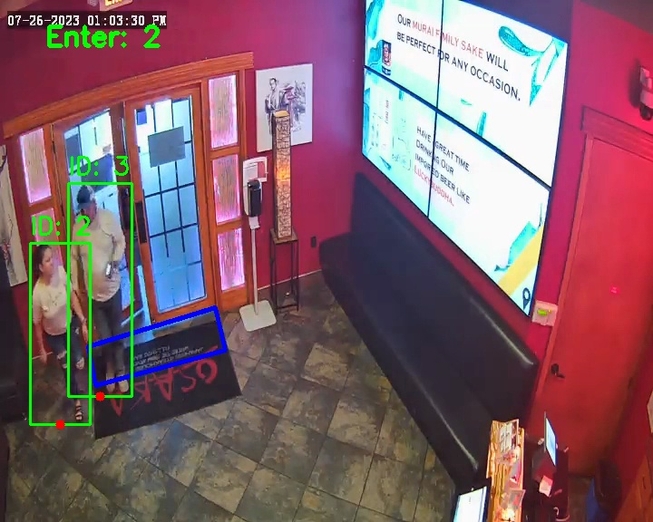

# Real-Time Object Detection and Tracking 

This project demonstrates a real-time object detection and tracking system using Yolov8, retinanet and DETR with the SORT algorithm. The system is designed to detect and track objects in a video stream, count the number of objects entering  a predefined region of interest (ROI), and save the processed video output.

## Project Overview

The project utilizes  DETR model,Yolov8, retinanet models  for object detection and the SORT (Simple Online and Realtime Tracking) algorithm for tracking detected objects across frames. The system is capable of:
- Detecting objects in each video frame.
- Tracking objects across frames using their bounding boxes.
- Counting the number of objects entering and exiting a defined polygonal ROI.
- Saving the output video with annotated bounding boxes and counts.

## Installation

To set up the environment and install the required dependencies, follow these steps:

1. Clone the repository:
    ```bash
    https://github.com/SindhuKavyaAlahari/Final_project.git
    cd Final_project
    ```

2. Create a virtual environment (optional but recommended):
    ```bash
    python -m venv venv
    source venv/bin/activate  # On Windows, use `venv\Scripts\activate`
    ```

3. Install the required Python packages:
    ```bash
    pip install -r requirements.txt
    ```

## Input Files
Dataset Link : https://cocodataset.org/#home
Input Video : https://drive.google.com/file/d/1YwrK0XWT47XK8S8S9Uqrcv3pnttF5JOC/view?usp=sharing

## Output :
- **DETR Detections**:
  


